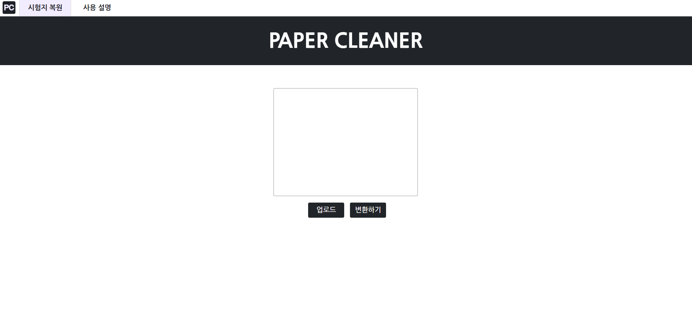
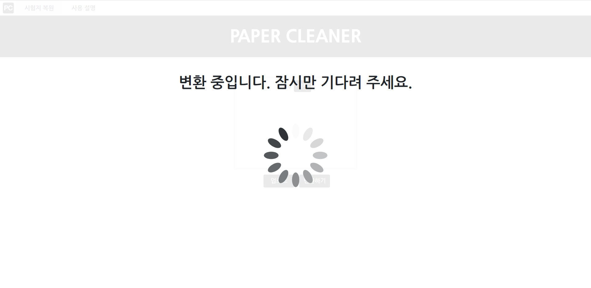

# Paper Cleaner

Paper Cleaner FrontEnd

## 메인화면

- 첨부파일 형식으로 이미지 업로드 기능 및 삭제 기능 구현
- 변환하기 버튼을 누르면 서버로 이미지 전달 및 다운로드 링크 요청

## 로딩화면

- styled-components와 스피너를 사용해 이미지 처리 중 로딩화면 구현

## 최종화면

- 처리가 완료된 이미지를 다운 받을 수 있는 다운로드 화면
- 다시 메인화면으로 돌아갈 수 있는 버튼
